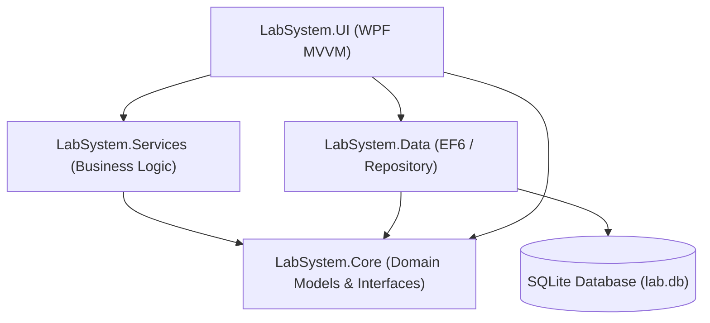

# Quality Diagnostics Center - Laboratory System

A comprehensive, enterprise-grade **Medical Laboratory Management System** designed to streamline clinic workflows and clinical analytics, built with a modern **.NET C# (WPF)** architecture.

This desktop application streamlines day-to-day laboratory operations including patient registration, test panel selection, specimen barcode tracking, clinical result entry, dynamic biological reference range checks (age & gender-specific) with automatic abnormality flagging, professional PDF report and invoice generation, and automated multi-format database backups.

The system is configured in a single-operator environment for maximum clinical throughput, skipping authentication hurdles and allowing instant dashboard interaction.

---

## 🌟 Key Features

### 👤 Patient Management
- **Directory System**: Search and list patients, register new entries, and manage clinical demographic profiles.
- **Diagnostics History**: Access historical records linking clinical test requests directly to patient profiles.

### 🧪 Test Ordering & Tracking
- **Interactive Panel Selection**: Select a patient and quickly place orders selecting from active clinical test types (e.g., Hemoglobin, WBC, Platelets, Fasting Glucose, Cholesterol).
- **Status Workflow**: Live tracking of orders transitioning from `Pending` (results need to be recorded) to `Complete` (results recorded and verified).

### 🩺 Result Entry & Automatic Abnormality Flagging
- **Input Validation**: Prevents errant inputs by validating numeric values for clinical parameters.
- **Automated Abnormality Flags**: Evaluates input parameters against biological reference ranges in real-time, automatically marking out-of-range values as `ABNORMAL` for priority technician review.

### 📄 Clinical PDF Report Generation
- **Hospital Branding**: Automatically generates professional clinical reports containing the Quality Diagnostics Center branding logo.
- **Tabular Results Layout**: Rendered via **MigraDoc / PDFsharp** with clean grids detailing measured values, normal ranges, units, and abnormality indicators.
- **Automated Delivery**: Once verified, the application builds, saves, and automatically opens the PDF report in the default system viewer.

### 💳 Billing & Invoicing System
- **Automatic Invoice Generation**: Generates patient invoices containing itemized charges for each test type requested in the order.
- **Payment Status Tracking**: Allows updating invoice status (e.g., from `PENDING` to `PAID`) with records of the payment method (Cash, Card, UPI, etc.).
- **Interactive Invoice Preview**: A WPF-integrated PDF preview window utilizing a `WebBrowser` control for seamless reviewing, printing, or downloading the invoice locally.
- **Professional Invoice PDF Layout**: Programmatically designs and renders high-quality invoice documents via **PDFsharp/MigraDoc** under daily dated subdirectories.

### ⚡ Performance & Scalability
- **Asynchronous Architecture**: Core data access and service operations utilize fully async/await patterns for responsive user experiences.
- **Database Indexing**: Entity Framework is configured with optimized indexing for foreign keys to ensure fast query execution.

### 💾 Multi-Format Backup Engine
- **Developer-Friendly SQLite Backups**: Creates timestamped physical copies of `lab.db` (stored in `Backups/Database/`).
- **Technician-Friendly Excel Reports**: Generates beautifully styled, multi-tab **ClosedXML Excel Workbooks** (stored in `Backups/Excel/`) featuring:
  - Custom brand colors & styling.
  - Dedicated worksheets for Patients, Test Orders, Test Results, Reference Catalog, and Staff Directory.
  - Alternating zebra-striped rows, auto-adjusted column widths, and highlighted abnormal test entries (light pink background with bold red text).

### 🧪 Test Panels
- **Grouped Panel Ordering**: Support ordering tests by clinical panels (e.g., Lipid Panel, CBC Panel, CMP Panel).
- **Auto-expansion**: Selecting a panel automatically selects all corresponding test types, streamlining ordering workflows.

### 🧬 Dynamic Biological Reference Ranges
- **Demographic Filters**: Reference ranges are configured by age limits and gender types instead of a single static global range.
- **Precise Flagging**: Dynamically evaluates the patient's age and gender at result validation time to flag results as `ABNORMAL` or `NORMAL` with maximum clinical accuracy.

### 📦 Specimen Lifecycle Tracking & Barcodes
- **Unique Barcodes**: Generate distinct barcodes and track progress across states: `Pending`, `Collected`, `Processed`, and `Rejected`.
- **Collection & Rejection Trails**: Logs specimen collection timestamps and reasons for rejection (e.g., Clotted, Hemolyzed) via a prompt-based modal dialog.

---

## 🏗️ Architecture & Decoupling

The system utilizes a decoupled, **layered architecture** conforming to the **MVVM (Model-View-ViewModel)** pattern for the user interface, separating presentation logic from business constraints and data access.



### Layer Breakdown

1. **`LabSystem.Core` (Domain Layer)**
   - **Models**: Defines domain models (`Patient`, `TestOrder`, `Result`, `TestType`, `Staff`, `Report`, `Invoice`, `Payment`, `ReferenceRange`, `TestPanel`, and `Specimen`).
   - **Interfaces**: Domain contracts establishing decoupling via Repository and Service abstractions (`IPatientRepository`, `ITestOrderRepository`, `IResultRepository`, `IBillingService`, `IBackupService`, etc.).
   - **Enums**: Shared enumeration categories.

2. **`LabSystem.Data` (Infrastructure/Persistence Layer)**
   - **Entity Framework 6**: Leveraged to implement ORM mapping for SQLite.
   - **DbContext Configuration**: Custom database context mapping schema conventions and foreign key relationships.
   - **Repositories**: Implements generic (`Repository<T>`) and specialized data access operations (e.g., patient querying, results tracking).
   - **Migrations**: Base SQLite database initialization schema (`V1__init.sql`).

3. **`LabSystem.Services` (Business Logic Layer)**
   - **Order Dispatching**: `OrderService` managing new clinical test requests and tracking.
   - **Diagnostics Verification**: `ResultService` checking clinical metrics against normal bounds, setting flags, and persisting data.
   - **Billing Service**: `BillingService` handles invoice creation, total amount calculation, and invoice settlement/payment tracking.
   - **PDF Engine**: `PdfReportService` assembling and outputting MigraDoc PDF structures (both clinical reports and invoice documents).
   - **Backup Utilities**: `SqliteBackupService` driving DB cloning and ClosedXML workbook composition.

4. **`LabSystem.UI` (WPF Presentation Layer)**
   - **Material Theme**: Styled using the **Material Design in XAML** toolkit, featuring clean typography, dynamic states, and harmonious colors.
   - **Modular WPF ViewModels**: Clean separation of Views (XAML files like `DashboardView`, `InvoicePreviewWindow`) and ViewModels. The monolithic `DashboardViewModel` is refactored into modular partial classes (`DashboardViewModel.Patients.cs`, `DashboardViewModel.Orders.cs`, `DashboardViewModel.Results.cs`, `DashboardViewModel.Billing.cs`, `DashboardViewModel.Catalog.cs`, `DashboardViewModel.LabFeatures.cs`, and `DashboardViewModel.Helpers.cs`) to isolate concerns and scale implementation.
   - **Dependency Injection**: Orchestrated via **SimpleInjector** to register transient DbContexts, data services, repository providers, and ViewModels.
   - **Serilog Diagnostics**: Writes runtime logs locally, cycling daily.

5. **`LabSystem.Tests` (Verification Layer)**
   - Includes NUnit and Moq unit testing suites verifying business rule constraints (e.g., `OrderServiceTests`, `ResultServiceTests`, `SqliteBackupServiceTests`).

---

## 🛠️ Technology Stack

* **Language**: C# 10.0 / .NET Framework 4.6.2 (utilizing SDK-style Csproj formatting)
* **User Interface**: WPF (Windows Presentation Foundation)
* **UI Themes**: MaterialDesignThemes (v4.9.0)
* **Database & ORM**: System.Data.SQLite & Entity Framework (v6.4.4)
* **Spreadsheet Engine**: ClosedXML (v0.102.2)
* **PDF Engine**: PDFsharp-MigraDoc (v6.2.4)
* **Dependency Injection**: SimpleInjector (v5.4.1)
* **Diagnostics Sink**: Serilog (v3.1.1) with Rolling File Sink
* **Testing Library**: NUnit (v3.14.0) & Moq (v4.18.4)

---

## 📁 Repository Layout

```text
Quality diagnostics center/
├── LabSystem.sln                  # Visual Studio Solution File
├── setup.ps1                      # Setup automation script (WPF & EF configuration)
├── seed.sql                       # Database seed SQL script
│
├── LabSystem.Core/                # Domain entities and interfaces
├── LabSystem.Data/                # DB context, repos, and EF migration setups
├── LabSystem.Services/            # PDF, backup, and business engines
├── LabSystem.UI/                  # WPF Views, ViewModels, assets, and configs
├── LabSystem.Tests/               # Automated unit tests (NUnit + Moq)
│
└── [Scaffolding & Diagnostics Tools]
    ├── find_dbs.py                # Searches for generated databases in build outputs
    ├── list_tables.py             # Prints SQLite database table structure
    ├── query_db.py                # Command-line utility to query the database
    ├── check_db.cs                # Console verification script for EF connections
    └── seed_db.py                 # Seeds the local SQLite database
```

---

## 🚀 Getting Started

### Prerequisites
1. **.NET SDK 6.0 or higher** (provides MSBuild tools to compile target Framework configurations).
2. **SQLite** (Optional, databases are automatically provisioned and self-contained).

### Setup and Database Bootstrapping
Re-bootstrap or provision the solution folders by running the PowerShell setup script (recommended for first-time builds):
```powershell
.\setup.ps1
```
*When the application launches, it automatically checks for a local database named `lab.db`. If missing, it applies the migration schema (`V1__init.sql`) and populates seed rows from `seed.sql`.*

### Command Line Build & Run
Restore dependencies, compile, and run the WPF desktop application:
```bash
# Restore package references
dotnet restore

# Build the solution
dotnet build

# Launch the WPF desktop application
dotnet run --project LabSystem.UI
```

---

## 🧪 Testing

Execute NUnit verification checks across core workflows:
```bash
dotnet test
```

---

## 📝 Scaffolding & Utility Scripts

To assist developers in analyzing local SQLite operations, several utility tools are included in the root folder:
- **`find_dbs.py`**: Locates and prints details of any local database clones produced within output folders.
- **`list_tables.py`**: Interrogates the active schema to display tables and index layouts.
- **`query_db.py`**: Executes direct SQL select statements from your terminal.
- **`check_db.cs`**: Simple console harness checking EF connection status.
- **`seed_db.py`**: Helper script to seed the database with initial records.
