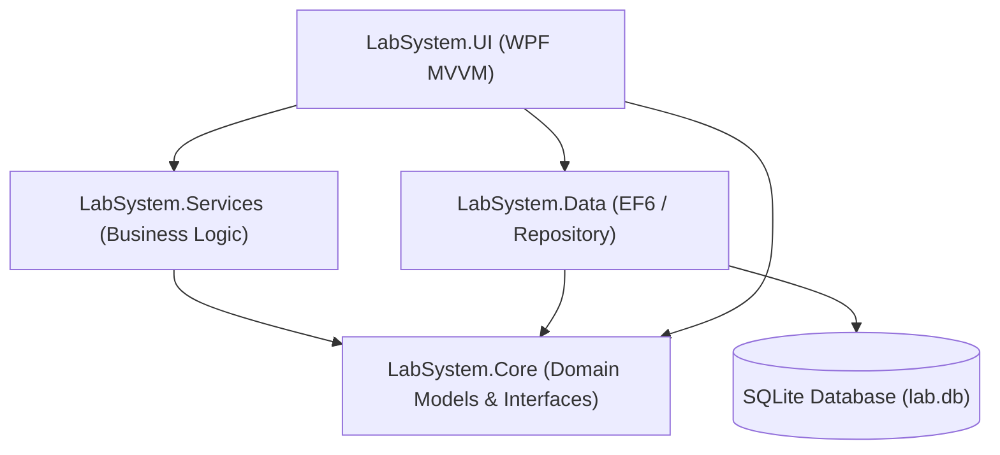

# Quality Diagnostics Center - Laboratory System 🏥

> A comprehensive, enterprise-grade **Medical Laboratory Management System** designed to streamline clinical workflows, client directories, and laboratory diagnostics, built with a **.NET Framework (WPF)** desktop architecture.

This powerful WPF application handles complete day-to-day laboratory operations including patient registration, referral doctor commission mapping, active panel/test type catalog navigation, keyboard-optimized clinical result entries, dynamic demographic reference ranges, professional PDF report generation, billing adjustments, and automated multi-format backups.

---

## ✨ Key Features

### 👤 Patient Management
*   **Demographic Profile System:** Search, view, and manage client profiles with dynamic filtering.
*   **Unified Register:** Fast registration utilizing a dropdown gender selection and age tracking.
*   **Historical Diagnostics Log:** Access a patient's historical test records linked directly to their profile.

### 🩺 Doctor & Referral Management
*   **Referral Tracking:** Link orders to referring doctors using a drop-down menu in the ordering process (defaults to "Self" if none selected).
*   **Commission Tracking:** Manage commissions for reference doctors. Track unpaid/paid commissions per invoice.
*   **Doctor Directory:** Complete CRUD operations for reference doctors, their contact info, and commission percentages.

### 🧪 Test Ordering & Catalog Management
*   **Test Catalog & Departments:** Tests are categorized dynamically under clinical departments (e.g., Biochemistry, Hematology, Microbiology).
*   **Grouped Panel Ordering:** Quickly order entire panels (such as Lipid Panel, CBC Panel, CMP Panel).
*   **Dynamic Price Calculations:** Displays running totals for selected tests and packages.

### ⌨️ Keyboard-Friendly Result Entry
*   **Optimized Grid Navigation:** Use arrow keys and the Enter key to move quickly between parameters, enabling high-speed results data entry.
*   **Double-Validation Flow:** Actions for "Verify & Save" to finalize the result, and "Edit" to unlock parameters for correction.

### 🧬 Dynamic Demographic Reference Ranges
*   **Demographic Filters:** Evaluates biological reference ranges based on the patient's age and gender.
*   **Real-time Flags:** Automatically flags values outside the demographic-specific reference range as `ABNORMAL` for priority verification.

### 💳 Billing & Invoicing System
*   **Flexible Settlements:** Choose between Cash and UPI payment methods.
*   **Taxes & Discounts:** Dynamically adds tax and discount lines to invoices.
*   **Due Tracking:** Automatically tracks unpaid/due amounts if partial or no payment has been made.
*   **Integrated Preview:** WPF-integrated PDF preview window utilizing an embedded browser control.

### 💾 Backup & Data Export Engine
*   **Automatic Exit Backup:** Backs up the SQLite database file when the app is closed.
*   **ClosedXML Excel Workbook:** Generates formatted multi-tab Excel workbooks containing worksheets for all critical data.
*   **Manual Single-File CSV Export:** Export all tables to a structured CSV file via the Settings menu.

### ⚙️ Operator & Settings Profile
*   **Operator Info Profile:** Customize clinic metadata (Name, Address, Phone) stored locally.
*   **Security & PIN Verification:** Setup and use PIN for high-privilege access and actions.
*   **Audit Logs:** Logs system events locally with daily rolling Serilog file sinks.

---

## 🏗️ Architecture & Decoupling

The system utilizes a decoupled, **layered architecture** conforming to the **MVVM (Model-View-ViewModel)** pattern for the user interface, separating presentation logic from business constraints and data access.



### Layer Breakdown

1.  **`LabSystem.Core`**: Domain entities, models, and interfaces.
2.  **`LabSystem.Data`**: Entity Framework 6 data context and repository implementations.
3.  **`LabSystem.Services`**: Business logic, PDF rendering, backing up, and billing services.
4.  **`LabSystem.UI`**: WPF presentation layer with Material Design.

---

## 🛠️ Technology Stack

*   **Language & Runtime:** C# 10 / .NET 6.0
*   **User Interface:** WPF (Windows Presentation Foundation) with MaterialDesignThemes
*   **Database & ORM:** SQLite and Entity Framework Core
*   **Spreadsheet Engine:** ClosedXML
*   **PDF Engine:** PDFsharp & MigraDoc
*   **Dependency Injection:** Microsoft.Extensions.DependencyInjection
*   **Logging:** Serilog with rolling daily file sinks
*   **Testing:** NUnit and Moq

---

## 🚀 Getting Started

### Prerequisites
1.  **.NET SDK 6.0 or higher**
2.  **Powershell 5.1+** (for setup automation).

### Setup and Database Bootstrapping
The application automatically provisions a local SQLite database (`lab.db`) on startup if it is not found in the output directory, applying migration scripts and populating seed values.

### Building and Running the Application
To restore packages, build the solution, and run the WPF application using the dotnet CLI:
```bash
# Restore package dependencies
dotnet restore

# Build the solution
dotnet build

# Launch the WPF desktop application
dotnet run --project LabSystem.UI
```

---

## 🧪 Testing

The solution includes a test suite covering billing logic, report layouts, backup integrity, and patient records.

To execute the unit tests:
```bash
dotnet test
```
