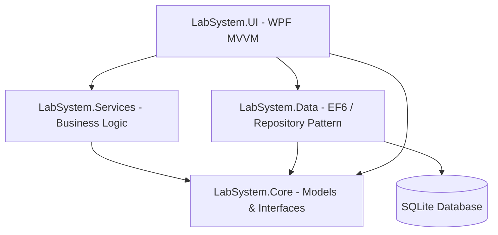

# Quality Diagnostics Center - Laboratory System

A comprehensive, enterprise-grade **Medical Laboratory Management System** built with **.NET C# (WPF)**. This application streamlines laboratory operations, including patient registration, test ordering, result verification, automatic abnormality flagging, professional PDF report generation, secure PIN-based authentication, audit logging, and automated database backups.

---

## 🌟 Key Features

- 👤 **Patient Management**: Register new patients and maintain historical diagnostic records.
- 🧪 **Test Ordering**: Create and manage test orders for multiple test types (e.g., Hemoglobin, WBC, Platelets, Fasting Glucose, Cholesterol).
- ⚙️ **Result Entry & Abnormality Flagging**: Input test results with real-time range-checking. Values falling outside normal reference ranges are automatically flagged as abnormal.
- 📄 **PDF Report Generation**: Instantly generate clean, professional, table-formatted PDF reports using **MigraDoc/PDFsharp** and automatically open them upon verification.
- 🔑 **Secure PIN Authentication**: Secure login access for administrators and technicians using cryptographically hashed PINs (**BCrypt**).
- 💾 **Database Backups**: Built-in SQLite backup utility that generates timestamped copies of the database.
- 📋 **Audit Logging**: Traceable log of laboratory actions, entities, and technicians for security compliance.
- 🎨 **Modern Material UI**: Rich, interactive desktop user interface powered by **Material Design in XAML** themes.

---

## 🏗️ Architecture

The system follows a clean, decoupled **layered architecture** coupled with the **MVVM (Model-View-ViewModel)** design pattern for the presentation layer.



### Layer Breakdown

1. **`LabSystem.Core`** *(Domain Layer)*:
   - **Models**: Defines entities like `Patient`, `TestOrder`, `Result`, `TestType`, `Staff`, `Report`, and `AuditLog`.
   - **Interfaces**: Contains repository and service contracts (`IRepository`, `IPatientRepository`, `ITestOrderRepository`, `IResultRepository`, `IAuthService`, etc.) ensuring decoupling.
   - **Enums**: Holds domain enums.

2. **`LabSystem.Data`** *(Infrastructure/Persistence Layer)*:
   - Implements data access using **Entity Framework 6** and **System.Data.SQLite**.
   - `LabDbContext`: Handles SQLite database configurations, conventions, and foreign keys.
   - **Repositories**: Direct database interaction with generic (`Repository<T>`) and specialized repositories (`PatientRepository`, `ResultRepository`, `TestOrderRepository`).
   - **Migrations**: SQL scripts for initial schema definition (`V1__init.sql`).

3. **`LabSystem.Services`** *(Application/Business Layer)*:
   - Core domain logic, orchestration, and integrations.
   - `AuthService`: Controls technician and admin login verification using BCrypt hashing.
   - `OrderService`: Handles test order creation, update, and logging.
   - `ResultService`: Validates, flags, and persists test results.
   - `PdfReportService`: Generates professional PDF documents from order data.
   - `SqliteBackupService`: Creates timestamped backups of the `lab.db`.

4. **`LabSystem.UI`** *(Presentation Layer)*:
   - Beautiful WPF interface styled with **Material Design Themes**.
   - Structured MVVM: views (`DashboardView`, `MainWindow`) separate from views' states (`DashboardViewModel`, `LoginViewModel`, `MainViewModel`).
   - Managed DI using **SimpleInjector** to register transient DbContexts, repositories, services, and viewmodels.
   - Structured logs generated daily using **Serilog**.

5. **`LabSystem.Tests`** *(Verification Layer)*:
   - Unit tests built on **NUnit** and **Moq** verifying core application services (e.g., `OrderServiceTests`, `ResultServiceTests`).

---

## 🛠️ Technology Stack

* **Language & Runtime**: C# 10.0 / .NET Framework 4.6.2 (SDK-style project structures)
* **UI Framework**: WPF (Windows Presentation Foundation)
* **UI Styling**: MaterialDesignThemes (v4.9.0)
* **Database / ORM**: SQLite + Entity Framework 6 (v6.4.4)
* **Security / Cryptography**: BCrypt.Net-Next (v4.0.3)
* **PDF Engine**: MigraDoc / PDFsharp (v1.50.5147)
* **DI Container**: SimpleInjector (v5.4.1)
* **Logging Framework**: Serilog (v3.1.1) with Rolling File Sink
* **Testing Stack**: NUnit, Moq, Microsoft.NET.Test.Sdk

---

## 📁 Repository Structure

```text
Quality diagnostics center/
│
├── LabSystem.sln                  # Visual Studio Solution File
├── setup.ps1                      # Setup automation script (WPF & EF configuration)
├── seed.sql                       # Database seed SQL script
│
├── LabSystem.Core/                # Domain models and Interfaces
├── LabSystem.Data/                # DbContext, Repository implementations, Init migrations
├── LabSystem.Services/            # Business logic, PDF rendering, backups
├── LabSystem.UI/                  # WPF Views, ViewModels, and Application configuration
├── LabSystem.Tests/               # NUnit unit & integration tests
│
└── [Utilities & Scaffolding Scripts]
    ├── seed_db.py                 # SQLite database seeder
    ├── query_db.py                # SQL database query script
    ├── list_tables.py             # Prints SQLite database tables structure
    ├── update_hash.py             # Generates or updates BCrypt hashes
    ├── check_db.cs                # Console verification script for database schema
    └── generate_*.py              # C# boilerplate scaffolding generators
```

---

## 🚀 Getting Started

### Prerequisites
1. **.NET SDK 6.0 or higher** (supports compiling .NET 4.6.2 projects).
2. **SQLite** (optional, database is automatically created and self-contained).

### Setup and Database Initialization
You can rebuild or bootstrap the solution structure by running the PowerShell script (recommended for first-time setup or cleanup):
```powershell
.\setup.ps1
```

When the application runs, it checks if `lab.db` is initialized. If it doesn't find the database, it automatically runs the migration schema `V1__init.sql` and populates the database using `seed.sql`.

### Default Login
Use the following seed credentials to log in:
* **Doctor Robert Brown** (Admin Role) - PIN: `1234`
* **Tech Sarah** (Technician Role) - PIN: `1234`

### Command Line Build & Run
To restore, build, and launch the application:
```bash
# Restore project dependencies
dotnet restore

# Build solution
dotnet build

# Launch the WPF application
dotnet run --project LabSystem.UI
```

---

## 🧪 Testing

To run the automated NUnit tests:
```bash
dotnet test
```

---

## 📝 Diagnostic Utility Scripts

The project includes convenient helper scripts at the root directory to ease development:
- **`find_dbs.py`**: Search and list the paths and sizes of generated `lab.db` files in build output directories.
- **`list_tables.py`**: Interrogate the SQLite database to verify table structures.
- **`query_db.py`**: Run quick SQL select statements on the local database from the terminal.
- **`update_hash.py`**: Utility to re-hash pins for insertion into the database staff seed rows.
