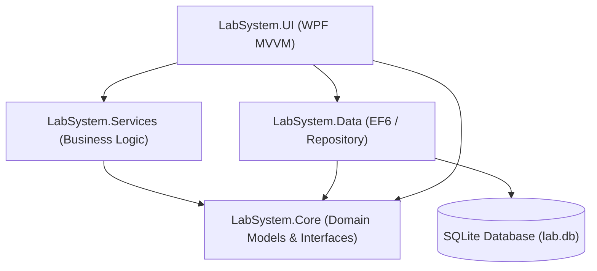

# Quality Diagnostics Center - Laboratory System

A comprehensive, enterprise-grade **Medical Laboratory Management System** designed to streamline clinical workflows, client directories, and laboratory diagnostics, built with a modern **.NET C# (WPF)** desktop architecture.

This WPF application handles complete day-to-day laboratory operations including patient registration, referral doctor commission mapping, active panel/test type catalog navigation, specimen lifecycle tracking, keyboard-optimized clinical result entries, dynamic demographic reference ranges, professional PDF report generation, billing adjustments, and automated multi-format backups.

---

## 🌟 Key Features

### 👤 Patient Management
*   **Demographic Profile System:** Search, view, and manage client profiles with dynamic filtering.
*   **Unified Register:** Fast registration utilizing a dropdown gender selection (Male, Female, Others) and age tracking.
*   **Historical Diagnostics Log:** Access a patient's historical test records linked directly to their profile.

### 🩺 Doctor & Referral Management
*   **Referral Tracking:** Link orders to referring doctors using a drop-down menu in the ordering process (defaults to "Self" if none selected).
*   **Commission Tracking:** Manage commissions for reference doctors.
*   **Doctor Directory Tabs:** Complete CRUD operations (Add, Update, Delete, View) for reference doctors, their contact info, and commission percentages.

### 🧪 Test Ordering & Catalog Management
*   **Test Catalog & Departments:** Tests are categorized dynamically under clinical departments (e.g., Biochemistry, Hematology, Microbiology).
*   **Grouped Panel Ordering:** Quickly order entire panels (such as Lipid Panel, CBC Panel, CMP Panel). Selecting a panel automatically selects and prices all constituent test types.
*   **Dynamic Price Calculations:** Displays running totals for selected tests and packages.

### 📦 Specimen Lifecycle & Barcode Tracking
*   **Unique Specimen Barcodes:** Automatically provisions unique barcodes for tracking specimens.
*   **State Machine Workflow:** Track specimens across states: `Pending`, `Collected`, `Processed`, and `Rejected`.
*   **Audit Trail Logs:** Prompts a modular dialog to log collection timestamps and detailed rejection reasons (e.g., Clotted, Hemolyzed).

### ⌨️ Keyboard-Friendly Result Entry
*   **Optimized Grid Navigation:** Use arrow keys and the Enter key to move quickly between parameters, enabling high-speed results data entry.
*   **Double-Validation Flow:** Actions for "Verify & Save" to finalize the result, and "Edit" to unlock parameters for correction.

### 🧬 Dynamic Demographic Reference Ranges
*   **Demographic Filters:** Evaluates biological reference ranges based on the patient's age and gender.
*   **Real-time Flags:** Automatically flags values outside the demographic-specific reference range as `ABNORMAL` for priority verification.

### 💳 Billing & Invoicing System
*   **Flexible Settlements:** Choose between Cash and UPI payment methods. Selecting a method marks the invoice as Paid and unlocks billing generation.
*   **Taxes & Discounts:** Dynamically adds tax and discount lines to invoices. Unused fields are omitted from printouts.
*   **Due Tracking:** Automatically tracks unpaid/due amounts if partial or no payment has been made.
*   **Integrated Preview:** WPF-integrated PDF preview window utilizing an embedded browser control to preview, download, or print invoices.

### 💾 Backup & Data Export Engine
*   **Automatic Exit Backup:** Backs up the SQLite database file (`lab.db`) to `Backups/Database/` when the app is closed.
*   **ClosedXML Excel Workbook:** Generates formatted multi-tab Excel workbooks containing worksheets for Patients, Orders, Results, Catalog, and Staff. Color-codes abnormal results in light pink with bold red text.
*   **Manual Single-File CSV Export:** Export all tables (Settings, Patients, Doctors, Departments, Test Catalog, Orders, Results, Invoices) to a structured CSV file via the Settings menu.

### ⚙️ Operator & Settings Profile
*   **Operator Info Profile:** Customize clinic metadata (Name, Address, Phone) stored locally in the database settings table.
*   **Audit Logs:** Logs system events locally with daily rolling Serilog file sinks.

---

## 🏗️ Architecture & Decoupling

The system utilizes a decoupled, **layered architecture** conforming to the **MVVM (Model-View-ViewModel)** pattern for the user interface, separating presentation logic from business constraints and data access.



### Layer Breakdown

1.  **`LabSystem.Core` (Domain Layer)**
    *   **Models:** Core entities including `Patient`, `TestOrder`, `Result`, `TestType`, `Staff`, `Report`, `Invoice`, `Payment`, `ReferenceRange`, `TestPanel`, `Specimen`, `Doctor`, `Department`, and `Setting`.
    *   **Interfaces:** Service and repository abstractions (`IPatientRepository`, `ITestOrderRepository`, `IResultRepository`, `IBillingService`, `IBackupService`, etc.).
2.  **`LabSystem.Data` (Infrastructure & Persistence Layer)**
    *   **Entity Framework 6:** Configured with ORM mappings for SQLite.
    *   **DbContext:** Custom database context mapping table structures and foreign key indexes.
    *   **Initializers:** Automated migration and seed script bootstrapping (`DatabaseInitializer.cs`).
3.  **`LabSystem.Services` (Business Logic Layer)**
    *   **Order and Result Engines:** `OrderService` and `ResultService` manage order state and demographic-specific ranges.
    *   **Billing & PDF Engines:** `BillingService` and `PdfReportService` manage payments and render MigraDoc PDF structures (both clinical reports and invoice layouts).
    *   **Backups:** `SqliteBackupService` handles DB cloning, ClosedXML workbook exports, and CSV backups.
4.  **`LabSystem.UI` (WPF Presentation Layer)**
    *   **Material Design:** Theme config using the **Material Design in XAML** toolkit.
    *   **Modular ViewModels:** The dashboard viewmodel is split into logical partial classes (`Patients`, `Orders`, `Results`, `Billing`, `Catalog`, `Doctors`, `Settings`, and `LabRework`) to isolate concerns and scale complexity.
    *   **Dependency Injection:** Managed via **SimpleInjector** to register database contexts, repositories, services, and viewmodels.

---

## 🛠️ Technology Stack

*   **Language & Runtime:** C# 10.0 / .NET Framework 4.6.2 (utilizing modern SDK-style `.csproj` templates)
*   **User Interface:** WPF (Windows Presentation Foundation) with MaterialDesignThemes (v4.9.0)
*   **Database & ORM:** SQLite and Entity Framework 6 (v6.4.4)
*   **Spreadsheet Engine:** ClosedXML (v0.102.2)
*   **PDF Engine:** PDFsharp & MigraDoc (v6.2.4)
*   **Dependency Injection:** SimpleInjector (v5.4.1)
*   **Logging:** Serilog (v3.1.1) with rolling daily file sinks
*   **Testing:** NUnit (v3.14.0) and Moq (v4.18.4)

---

## 📁 Repository Layout

```text
Quality diagnostics center/
├── LabSystem.sln                  # Visual Studio Solution File
├── setup.ps1                      # Setup automation script (WPF & EF configuration)
├── seed.sql                       # Database seed SQL script
├── appsettings.example.json       # Settings template file for development config
│
├── LabSystem.Core/                # Domain entities, interfaces, and services
├── LabSystem.Data/                # DB context, repository implementations, and EF setups
├── LabSystem.Services/            # PDF rendering, backup, and billing services
├── LabSystem.UI/                  # WPF Views, ViewModels, Converters, and App config
└── LabSystem.Tests/               # Unit testing suites (NUnit + Moq)
```

---

## 🚀 Getting Started

### Prerequisites
1.  **.NET SDK 6.0 or higher** (provides MSBuild tools to compile target Framework configurations).
2.  **Powershell 5.1+** (for setup automation).

### Setup and Database Bootstrapping
Before building for the first time, run the automated setup script in an Administrator PowerShell console to provision directories and compile initial NuGet package assets:
```powershell
.\setup.ps1
```
*Note: The application automatically provisions a local SQLite database (`lab.db`) on startup if it is not found in the output directory, applying migration scripts and populating seed values.*

### Building and Running the Application
To restore packages, build the solution, and run the WPF application using the dotnet CLI:
```bash
# Restore package dependencies
dotnet restore

# Build the solution
dotnet build

# Launch the WPF desktop application
dotnet run --project LabSystem.UI
```

---

## 🧪 Testing

The solution includes a test suite covering billing logic, report layouts, backup integrity, and patient records.

To execute the unit tests:
```bash
dotnet test
```
